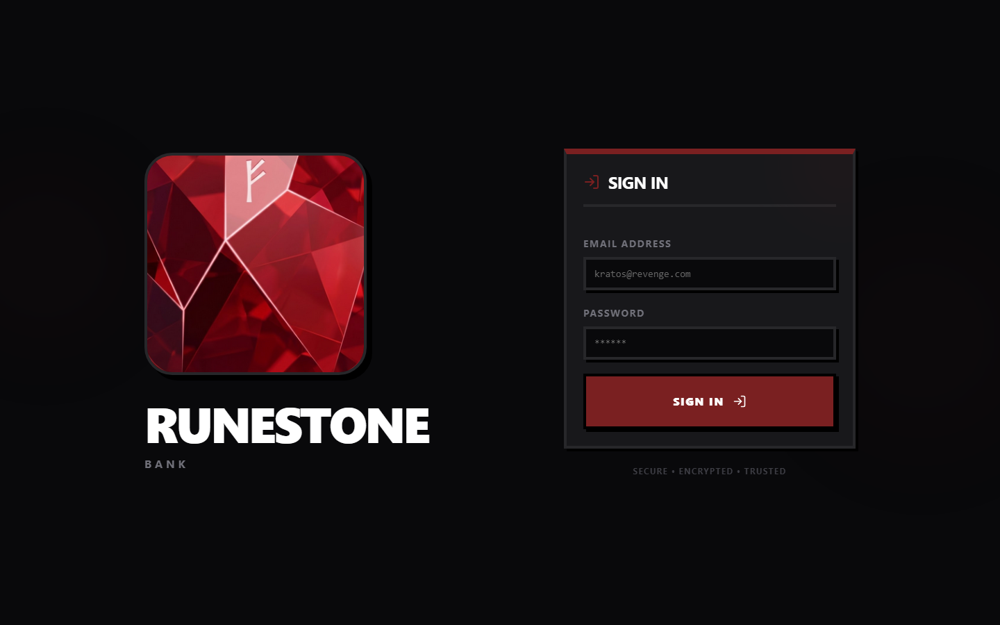
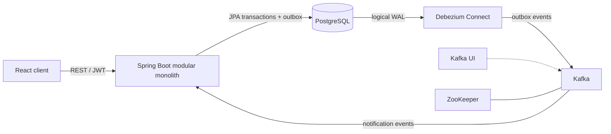

# RuneStone Bank

## What is it?

RuneStone is a full-stack banking app with account management, transfers, transaction history, bank statements, and email notifications.

Most of the interesting stuff is in the backend: a Spring Boot modular monolith written in Java and Kotlin. The web client is React and TypeScript.



## Why all the moving parts?

The server could update a balance and publish straight to Kafka, but there could be scenarios where one of those operations fails and the system is inconsistent. Instead, I opted to save the account change and the outbox event in the same Postgres transaction. Debezium watches the Postgres write-ahead log and sends the committed events to Kafka, so stuff like notifications can happen later without sitting in the transfer request.

## How it works



Debezium Connect is included in the local stack, but its connector must be registered separately.

## How to run it

Install Docker, Docker Compose, and Node.js 20.19 or newer.

From the repository root, copy `.env.example` to `.env` and replace its placeholder values. `JWT_SECRET` must be Base64-encoded and decode to at least 32 bytes.

Start the backend and infrastructure:

```bash
docker compose --env-file .env -f infra/docker-compose.yml up -d --build
```

Start the frontend in another terminal:

```bash
cd client
npm install
npm run dev
```

Open `http://localhost:5173`.

### Useful URLs

| Service | URL |
| --- | --- |
| Swagger UI | `http://localhost:8081/swagger-ui/index.html` |
| Application health | `http://localhost:8081/actuator/health` |
| Kafka UI | `http://localhost:8082` |
| Kafka Connect API | `http://localhost:8083` |

Stop the stack without deleting its data volumes:

```bash
docker compose --env-file .env -f infra/docker-compose.yml down
```

## Development

Run the backend tests:

```bash
cd server
./gradlew test
```

On Windows, use `.\gradlew.bat test`.
